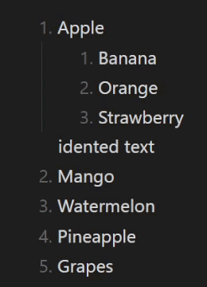

# Automatic Renumbering Plugin for Obsidian

The Automatic Renumbering plugin helps keep your numbered lists in sequential order automatically, which is particularly useful for users who frequently work with structured documents. It features live updates, smart pasting, and manual control options.

## ⚠️ Limitations

Before proceeding with the installation, please note the following limitations:

-   Manual specification of your preferred tab size in the plugin settings is required for correct nested numbering.

-   The _live update_ feature is not supported in **Vim mode**, as it is temporarily disabled when using special keys (`Ctrl`, `Command` on Mac, or `Alt/Option`), and as a result, it is turned off by default. However, you can still manually use the renumbering commands.

## Installation Steps

> Step 3 is **mandatory** for accurate parsing of indentations.

1. In Obsidian, go to **Options → Community plugins → Browse** and search for **Automatic Renumbering**.
2. Click **Install** and enable the plugin.
3. In the plugin settings, adjust the **tab size** to match your editor's settings (found under **Options → Editor → Tab indent size**).

Once installed, the plugin will automatically manage your numbered lists.

## Configuration Options

-   **Live Update**: Automatically renumbers lists as you edit, helping maintain accurate sequencing without manual adjustments. Manual commands are available if you prefer to manage updates yourself.

-   **Smart Pasting**: Maintains the original numbering sequence of the list, rather than applying the numbering from the pasted content.

start numbering from 1

tab size

-   Manual specification of your preferred tab size in the plugin settings is required for correct nested numbering, as the plugin cannot automatically detect tab sizes. This step must be followed to ensure proper functionality.

 
<table>
  <tr>
    <td style="text-align: center;">
      
      
<em>Regular pasting</em>

    </td>
    <td style="text-align: center;">
      
      
<em>Smart pasting</em>

    </td>
  </tr>
</table>

## Available Commands

-   **Renumber at Cursor**: This command renumbers the list that the cursor is within, regardless of where the cursor is placed.
-   **Renumber Selected Lists**: If you highlight multiple numbered lists, this command renumbers all of them at once.
-   **Renumber the Entire Note**: Renumbers every numbered list in your active note.

## Performance

The live update feature renumbers lists locally, adjusting only the lines up to the first correctly numbered line, which reduces unnecessary calculations.
The plugin was tested with documents containing lists with over 10,000 lines, and no performance issues were found on my machine.
