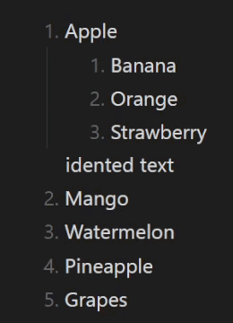
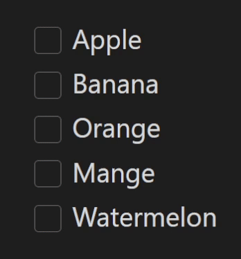

# Automatic List Management Plugin for Obsidian

This plugin automatically manages your lists in Obsidian, handling both numbered lists and checklists.

  <table>
  <tr>
    <td style="text-align: center; vertical-align: middle;">
      
    </td>
    <td style="text-align: center; vertical-align: middle;">
      
    </td>
  </tr>
</table>

## Features

### Checklists

-   Automatic reordering of checked/unchecked items
-   Configurable sorting (checked items are sorted to the bottom or to the top)
-   Smart handling when pasting or dragging content
-   Works with mouse and keyboard interactions

### Numbered Lists

-   Automatic renumbering as you type
-   Smart pasting that preserves list context
-   Option to maintain or reset starting numbers

### General

-   Handles deeply nested lists
-   High performance even with large documents
-   Manual commands for control

## Installation Steps

> Step 3 is required for accurate parsing of indented lists.

1. In Obsidian, go to **Options → Community plugins → Browse** and search for **Automatic List Reordering**.
2. Click **Install** and enable the plugin.
3. In the plugin settings, adjust the **tab size** to match your editor's settings (found under **Options → Editor → Tab indent size/Indent visual width**).

## Configuration Options

### Checklists

-   **Auto-sort on changes**: Sorts checklist items automatically when they are checked.

-   **Sorting position**: Choose whether checked items should be placed at the top or bottom of the list.

-   **Sort all special checkboxes**: When enabled, tasks with any special checkbox characters will be sorted by [ASCII](https://en.wikipedia.org/wiki/ASCII). When disabled, only tasks marked for deletion will be sorted.

-   **Checkbox delete characters**: Specify which checkbox characters mark tasks for deletion. Tasks with these characters are always sorted below tasks with other characters, and can be removed by using the delete command.

### Numbered lists

-   **Auto-renumber on changes**: Automatically update numbered lists as you edit without manual adjustments. Additional commands are available if you prefer to manually control which lists to renumber.

-   **Smart pasting**: Keeps the numbering intact when pasting content into an existing list, rather than adopting the numbering from the pasted text.

-   **Start numbering from 1**: When enabled, all numbered lists will be numbered starting from 1.

 

  <em>Content in clipboard:</em>
  <ol>
    <li>Apple</li>
    <li>Banana</li>
  </ol>
  <table>
    <tr>
      <td style="text-align: center; vertical-align: middle;">
        
        
<em>Regular pasting</em>

      </td>
      <td style="text-align: center; vertical-align: middle;">
        
        
<em>Smart pasting</em>

      </td>
    </tr>
  </table>

## Available Commands

-   **Reorder checkboxes: In selection or at cursor**: Reorders checked/unchecked items within the checklist at your cursor position. If multiple checklists are selected, reorders all of them.

-   **Reorder checkboxes: Entire note**: Reorders all checked/unchecked items in every checklist throughout your note.

-   **Delete all checked Items in note**: Removes all tasks that contain the specified delete characters in their checkboxes throughout your note.

-   **Renumber lists: In selection or at cursor**: Renumbers the list that the cursor is within. If multiple lists are highlighted, renumbers both of them separately.

-   **Renumber lists: Entire note**: Renumbers every numbered list in your note.

## Performance

The plugin was tested with documents containing lists with over 10,000 lines, and no performance issues were found on my machine.

## Known bugs & Limitations

-   **Modifier keys**: To avoid conflicts with keyboard shortcuts, the automatic update is temporarily disabled when modifier Keys (`Ctrl`, `Command` on Mac, or `Alt/Option`) held down during editing.
-   [Reordering checklists items with their sub-items](https://github.com/OmriLeviGit/Auto-List-Management-Obsidian/issues/5)
